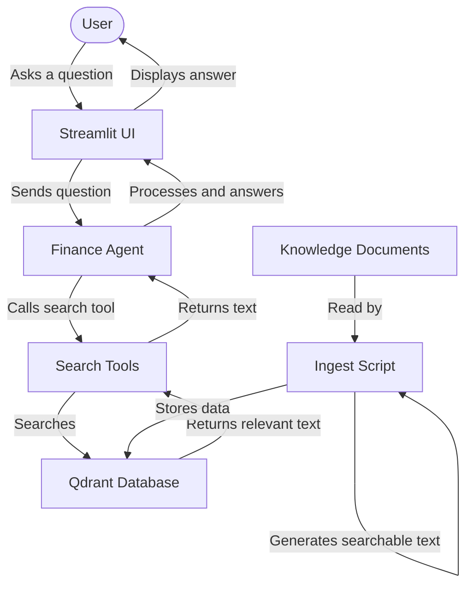

# Peakvisory AI Assistant

This project is a smart chatbot designed to help you find information about Peakvisory. It can answer questions about company services, pricing packages, onboarding processes, and policies. Instead of searching through many different documents yourself, you can just ask the chatbot and it will find the answer for you.

## How It Works

The project has two main parts:

1.  **The Brain (AI Agent)**: This part reads your question and decides how to answer it. It uses an AI model to understand your question and formulate a response.
2.  **The Memory (Database)**: This part stores all the company documents in a special way that makes them easy to search.

When you ask a question, the Brain searches the Memory for the most relevant information. It then combines that information with its own understanding to give you a clear answer.

### Information Flow

Here is a diagram showing how information moves through the system when you ask a question:



## How to Set It Up

Follow these steps to get the project running on your computer. These instructions are written for anyone to follow, even if you do not have much technical experience.

### Step 1: Install Python

You need to have Python installed on your computer. If you do not have it, you can download and install it from the official Python website. Make sure to check the box that says "Add Python to PATH" during installation.

### Step 2: Install the Required Tools

Open your computer's terminal or command prompt. Navigate to the folder where this project is located. Run the following command to install all the software packages the project needs:

```bash
pip install streamlit qdrant-client fastembed groq pydantic-ai pydantic-settings python-dotenv rich
```

### Step 3: Set Up Your Configuration

1.  Look for a file named `.env.example` in the project folder.
2.  Make a copy of this file and name the copy `.env`.
3.  Open the `.env` file in a text editor.
4.  Find the line that says `GROQ_API_KEY=gsk_your_key_here`.
5.  Replace `gsk_your_key_here` with your actual Groq API key. You can get a free key by creating an account on the Groq website.
6.  Save the file.

### Step 4: Start the Database

This project requires a database called Qdrant to be running. If you have Docker installed, you can start it by running this command in a separate terminal window:

```bash
docker run -p 6333:6333 qdrant/qdrant
```

If you do not have Docker, you will need to ensure a Qdrant instance is running and accessible at the address specified in your `.env` file (usually `http://localhost:6333`).

### Step 5: Load the Documents

Before the chatbot can answer questions, it needs to read and process the company documents. Run the following command to do this:

```bash
python scripts/ingest.py
```

This script will read the files in the `knowledge` folder and store them in the database.

### Step 6: Run the Chatbot

Now you can start the chatbot interface. Run this command:

```bash
streamlit run app/main.py
```

A new tab should open in your web browser showing the chat interface. You can now start asking questions about the company.

## Project Structure

-   **app**: Contains the code for the web interface that you see in your browser.
-   **knowledge**: Contains the text files that the chatbot reads to learn about the company.
-   **scripts**: Contains the script used to load the text files into the database.
-   **src**: Contains the core logic for the AI agent and the search functionality.

## Frequently Asked Questions (FAQ) and Debugging

### Why am I getting a connection error to Qdrant?
This happens when the database is not running. Make sure you have started Qdrant using Docker or that you have a Qdrant instance running at the address specified in your `.env` file.

### Why is the AI not answering questions?
Check your `.env` file to make sure your `GROQ_API_KEY` is correct. Also, ensure you have an active internet connection so the app can talk to the AI service.

### How do I add more information for the chatbot to read?
1. Put your new text files (in Markdown format) into the `knowledge` folder.
2. Run the command: `python scripts/ingest.py`
This will update the database with the new information.

### The app says a file is missing. What do I do?
Make sure you are running the commands from the main folder of the project, not from inside the `app` or `scripts` folders.

## Git Setup

To prepare this project for Git and push it to a remote repository like GitHub:

1. Initialize Git:
   ```bash
   git init
   ```
2. Add files:
   ```bash
   git add .
   ```
3. Commit:
   ```bash
   git commit -m "Initial commit"
   ```
4. To push to GitHub, create a new repository on GitHub, then run the commands they provide, which usually look like:
   ```bash
   git remote add origin <your-repository-url>
   git branch -M main
   git push -u origin main
   ```
